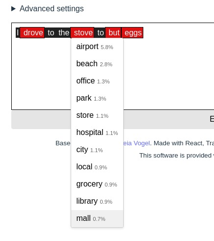

# GPTed blog post

## Part 1



What I want to cover:
- The original blog post
- Improvements that I wanted to make:
	- In addition to highlighting low-probability words, show replacement suggestions that are more likely
	- Operate at the level of whole words, not tokens
- Justification for using a local model
	- Limitations of the logprobs returned by the APIs
- Main parts of the project
	- Combining tokens into words to get the probabilities of whole words
	- The batched multi-token expansion with probability budget
	- Testable abstract implementation


This post describes my attempt to build an improved version of GPTed from https://vgel.me/posts/gpted-launch/ and what I learned from it.

Here is what has been done in the original GPTed:
- Use logprobs returned by the OpenAI API (in particular, the /v1/completions legacy api https://platform.openai.com/docs/api-reference/completions) for tokens _in the existing text_ (as opposed to generated text) to detect the tokens the model is surprised by
- Provide a basic text editing UI that has a mode in which the tokens with a logprob below a given threshold are highlighted. Not all highlighted tokens are necessarily a mistake, but the idea is that it may be worth checking that a low-probability token is indeed intended.

Here are the improvements that I wanted to make:
- Operate at the word level, instead of token level, to compute the log prob of whole words even if they are mutli-token, and to highlight whole words
- Propose replacement words for the highlighted words
	- Specifically, words with probability higher than the flagging threshold

### On logprobs in OpenAI API

The original GPTed project relied on the 2 features in the legacy OpenAI /v1/completions API:

> logprobs: Include the log probabilities on the `logprobs` most likely output tokens, as well the chosen tokens. For example, if `logprobs` is 5, the API will return a list of the 5 most likely tokens. The API will always return the `logprob` of the sampled token, so there may be up to `logprobs+1` elements in the response. The maximum value for `logprobs` is 5.

> echo: Echo back the prompt in addition to the completion

The echo parameter doesn't exist anymore in the modern chat completions API /v1/chat/completions, making it impossible to get logprobs for an existing text (as opposed to generated text). The legacy completions API is not available for modern models like GPT4 (FIXME verify this claim).

Also, the limit of 5 for the number of logprobs is also quite limiting: there may well be more than 5 tokens above the threshold, and I would like to be able to take all of them into account.

Also, the case of multi-token words meant that it would be convenient to use batching, which is not available over the OpenAI API.
For the above 3 reasons, I decided to switch to using local models.

### Local models with huggingface transformers
To run inference locally and get the logits I used huggingface transformers. As model, I used Llama 3.2 1B, because it runs fast enough on a CPU to enable local development on my laptop.
The basic usage to get logits for every token in an input is straightforward:

```python
from transformers import AutoTokenizer, AutoModelForCausalLM

model_name = "unsloth/Llama-3.2-1B"
tokenizer = AutoTokenizer.from_pretrained(model_name)
model = AutoModelForCausalLM.from_pretrained(model_name)

input_text = "Hello world!"
inputs = tokenizer(input_text, return_tensors="pt")

with torch.no_grad():
	outputs = model(**inputs)

logits = outputs.logits # Shape: [batch_size, sequence_length, vocab_size]
```

Here is how I compute the logprob for every token in the input:

```python
def calculate_log_probabilities(model: PreTrainedModel, tokenizer: Tokenizer, inputs: BatchEncoding) -> list[tuple[int, float]]:
    input_ids = inputs["input_ids"]
    attention_mask = inputs["attention_mask"]
    with torch.no_grad():
        outputs = model(input_ids=input_ids, attention_mask=attention_mask, labels=input_ids)
    # B x T x V
    logits: torch.Tensor = outputs.logits[:, :-1, :]
    # B x T x V
    log_probs: torch.Tensor = torch.log_softmax(logits, dim=-1)
    # T - 1
    tokens: torch.Tensor = input_ids[0][1:]
    # T - 1
    token_log_probs: torch.Tensor = log_probs[0, range(log_probs.shape[1]), tokens]
    return list(zip(tokens.tolist(), token_log_probs.tolist()))
```

Explanation:
- we drop the logits for the last token, because it corresponds to the probability of the next token (which we don't have)
- we compute the softmax over the last dimension (vocab size), to obtain probability distribution over all tokens
- we drop the first token because it is a start-of-sequence token
- `log_probs[0, range(log_probs.shape[1]), tokens]` indexes into log_probs such as to extract
  - at position 0 (probability distribution for the first token after the start-of-sequence token) - the logprob value corresponding to the actual first token
  - at position 1 (probability distribution for the second token after the start-of-sequence token) - the logprob value corresponding to the actual second token
  - etc.


Here is how I handled combining tokens into words.

I wrote a very generic `combine` function, that takes a list of values and a function that tells it how to combine two adjacent values into a single value. If the function returns `None`, the values are not combined.

Thanks to the fact that it is generic, it is very easy to test:


```python
def test_add_if_even():
    def add_if_even(x: int, y: int) -> int | None:
        if (x + y) % 2 == 0:
            return x + y
        return None

    assert combine([1, 3, 1, 4], add_if_even) == [4, 1, 4]
    assert combine([1, 3, 2, 4], add_if_even) == [10]
```

Applying this function to the problem of combining tokens into words is just a matter of writing the correct `combine_fn`:

```python
@dataclass
class Tok:
    index: int
    ids: list[int]
    str: str
    logprob: float

def is_beginning_of_word(s: str) -> bool:
    return (s[0] == " " and s[1:].isalpha()) or s.isalpha()

def is_continuation_of_word(s: str) -> bool:
    return s.isalpha()

def merge_tokens(a: Tok, b: Tok) -> Tok | None:
    if is_beginning_of_word(a.str) and is_continuation_of_word(b.str):
        return Tok(a.index, a.ids + b.ids, a.str + b.str, a.logprob + b.logprob)
    return None
```

This handles nicely the computation of combined logprob for words, and allows me to highlight whole words based on a threshold.

The next step was to produce suggestions for replacement words.

Here is how I do it:

Extract the contexts (lists of token prefixes -- all tokens up to the word in question) for each flagged word:

```python
contexts = [word.context for _, word in low_prob_words]
```

Create a `Series` for each context (a series has a budget), and bundle them into a `Batch`:
```python
series = []
for i, x in enumerate(contexts):
    series.append(Series(id=i, tokens=x, budget=5.0))

batch = Batch(items=series)
```

Stopping criterion decides when to stop expanding a series

```python
stopping_criterion = create_stopping_criterion_llm(tokenizer)
```

In my case, I stop when the budget is exhausted, and I also stop if the expansion reached a word boundary (I'm only interested in single-word replacements).

Given the batch and the stopping criterion, we can call the expander:
```python
expander = LLMBatchExpander(model, tokenizer)
expanded = expand(batch, expander, stopping_criterion)
```

The `expand` logic is the most complex part of the project, and in order to make it testable, I made it generic, with only a small part that is llm-specific.

Here is what the tests look like:

```python
def test_expander_zero_budget():
    s = Series(id=0, tokens=[1], budget=0.0)
    expanded = expander.expand(Batch(items=[s]))
    expected = ExpansionOneResultBatch(
        items=[ExpansionOneResult(series=s, expansions=[
            Expansion(token=21, cost=-1.0),
            Expansion(token=22, cost=-1.0),
        ])]
    )
    assert expected == expanded
```

They are based on a non-llm expander based on a hardcoded list of possible expansions, so they are very easy to write, straightforward to interpret, and run very fast.

### Limitations of the decoder-only approach

The main limitation of using decoder-only models like GPT or Llama for this task is the unidirectional attention. It means that we are not using the context on the right of the word. This is especially problematic at the start of the text: the first tokens get very little context, so the the probabilities we get from the model are not very useful. The obvious solution is to use a model with bi-directional attention, such as BERT. This will be covered in the part 2 of the post.

### Other potential possibilities / ideas
- Instead of using a local model, investigate using an API of a provider that exposes logprobs e.g. replicate

## A digression on encoder vs decoder, unidirectional vs bidirectional attention, and whether we could use bidirectional attention for text generation

It is a common misconseption that autoregressive text generation _requires_ unidirectional attention, whereas in reality it is only a matter of efficiency (efficiency at both training and inference time). It is possible to train models with bidirectional attention on next token prediction, and to use them autoregressively at inference, and arguably it would give better quality than unidirectional attention (the bidirectional flow of information between tokens in the current prefix can only be beneficial, e.g. if we are generating the next token in "the quick brown fox jumped over", there is no benefit in not letting "fox" to see "jumped"). However, bidirectional attention would mean that we cannot learn from every token in a text by passing only 1 instance of it through the model, we would have to pass every prefix individually. And at inference time, it would rule out the techniques such as KV caches which are used ubiquitously at all modern LLM deployments for inference, because all attention would need to be recomputed for every prefix.

## Part 2

Applying encoder-only models (those with bidirectional attention) to this task presents several challenges.

Whereas unidierctional attention in decoder-only models enables them to be efficiently trained on the task of next token predition, and used for autoregressive text generation, with an important property of returning logprobs for every input token as a byporduct, encoder-only only models like BERT are trained on masked token prediction (also on next sentence prediction), and it is from this fact that the difficulties arise:

- We cannot get logprobs for all tokens in a given text by passing a single instance of it through the modesl. Instead, because we need to mask individual tokens, replicating the input as many times as there are tokens. It can still be done in 1 pass / 1 batch, but the size of the batch in N_tokens instead of 1 in the decoder-only case.
- For multi-token words, it is not clear if replacing them by a sequence of mask tokens would give results (if model is trained to predict multiple adjacent mask tokens)
- Generating replacesments poses an additional difficulty: we don't know beforehand how many tokens the replacement word would consist of, so naively we'd need to try all possible sequences [MASK], [MASK][MASK], [MASK][MASK][MASK], and so on until a reasonable limit of the number of tokens in a word.

Even if we get the logprobs for a sequence of mask tokens, how do we interpret them? What we need in order to generate candidate words (and to compute their probability) are _conditional_ probabilities of the second token given the first one, the third one given the first two, and so on, but logporbs for a sequence of mask tokens don't give us that.

Speculation: either the logprobs of the second [MASK] in a sequence represent probabilities of tokens at that place _given that the previous token is [MASK]_ (and of course given all other actual non-mask and mask tokens at all other positions), or they represent probabilities for tokens in the second position averaged over all possible tokens in position 1, possibly roughly weighted according to the probabilities of the tokens at position 1 (FIXME: is there even a way to know this?)
